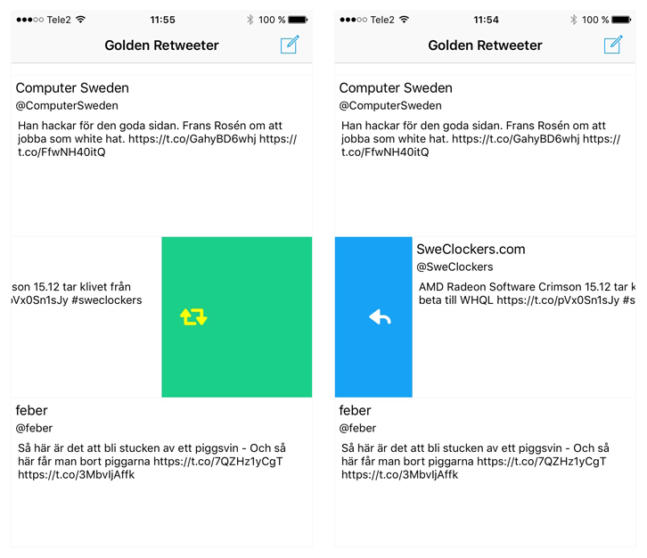

# Golden Retweeter
Tiny and swipeable Twitter application

* Twitter feed presented as a list or grid depending on orientation
* Swipe right to reply
* Swipe left to retweet
* Pull to refresh

## Current limitations
* Single user authentication
* Static size tweet cells
* Feed backtracking (can't load older tweets)
* Media (no photos, profile pictures etc.)
* Can't remove tweets or retweets
